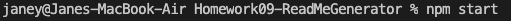
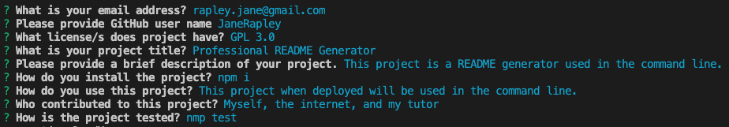
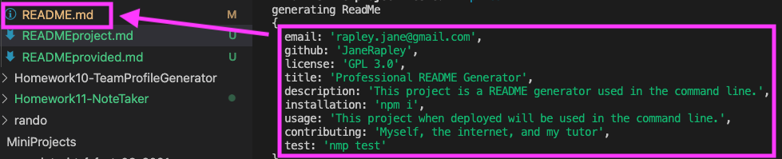

# Professional README Generator

## Project Description
This project project utilized a couple different languages and dependicies to become operational. First the index.js file was created calling on our  dependencies inquirer, path, fs, and a file created later generateMarkdown. This file needed to contain the prompts that would appear in the users terminal. After this functions to write the file and initialize the app. Once this was taken care of the Markdown was tackled. The information input from the prompt questions will be dynamically inserted into the MarkDown language. This is a handy tool when a user needs a README generated quickly for a project. 

While working through this project I learned how to dynamically insert information, and obtained greater understanding of how much functions call accomplish.

## Project Examples 
To begin using this project type npm i in your command terminal.

You will be prompted with several questions to answer that will populate your generated README.md file.

The information you provided will be shown again and generated into a brand me README.md file

[Link to Screencastify recording of project in use](https://drive.google.com/file/d/1tpoZ29VfWFFBgpRUOhQoGHUO1W1DQN0h/view)

## Installation
To install this project you will need to clone the repository to your machine. Then you will open your terminal in the corresponding file and type "npm start" this will start the program.

## Usage
Use this project as a quick README starter. It covers the basic sections and file creation. You can go back into the file and add anymore necessary information as you see fit.

## Credits
Thank you to Google and my awesome tutor!
